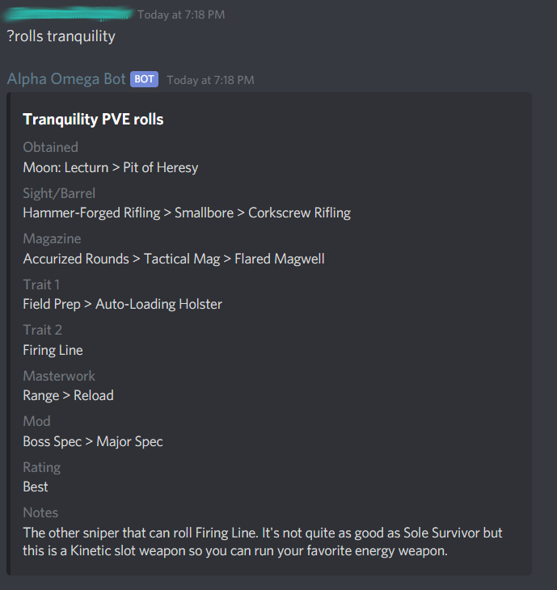
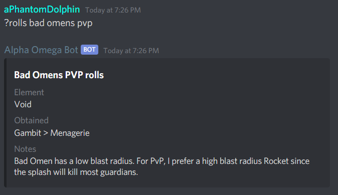
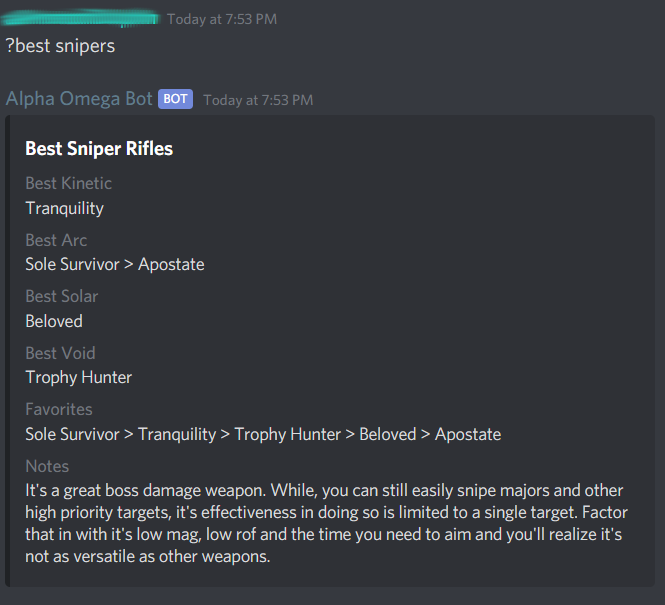
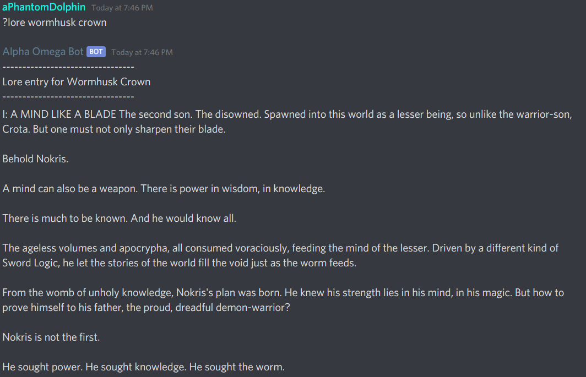
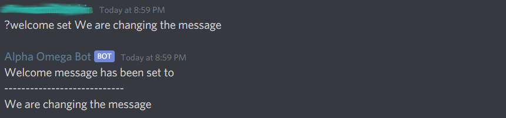
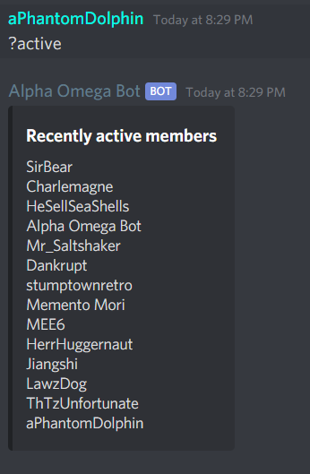

#### Note

The main_bot.js is in the root directory because heroku and the local filesystem use different relative paths otherwise, breaking the program.

# Bot for Alpha Omega Destiny 2 clan

Bot I created to help with some clan functionalities. Hosted on Heroku personal account.

All requests should begin with the '?' character, followed by any arguments

## Weapon Rolls

Returns an embed with the best rolls for each slot on in-game weapons. This information is provided through an API that is updated with new information by clan member Jiangshi.

### Usage

```javascript
// General
?rolls <weapon_name> [pve|pvp]

// Examples
?rolls tranquility
?rolls bad omens pvp
```

### Output




## Best weapons in each weapon class

Returns an embed with the best weapons in each weapon class depending on what criteria you want. This information is provided through an API that is updated with new information by clan member Jiangshi.

### Usage

```javascript
// General
?best <weapon_class>

// Example
?best snipers
```

### Output



## Lore

Returns a message with the lore for an item. The information is retrieved through web scraping on [Ishtar Collective](https://www.ishtar-collective.net/).

### Usage

```javascript
// General
?lore <item_name>

// Example
?lore workhusk crown
```

### Output



## Welcome message to new members

Automatically sends a welcome message to new clan members when they join the discord server. This welcome message is loaded from a text file every time the server restarts. There is functionality to set, reset, and view the current welcome message through the discord server.

### Usage

```javascript
// General
?welcome view                   // Views current message
?welcome set <message>          // Sets message to <message>
?welcome set --default          // Sets message to the default message

// Examples
?message set We are changing the message
```

### Output
Note: The `<@${user.id}>` section of the message is compiled when the DM is actually sent in order to fill in the user's name using string interpolation. For the purposes of viewing the message in discord, however, it must be stored in plaintext when being sent.




## Active Members

This returns a message that displays all members who have sent a message since the server last booted. The server boots every 24 hours. I was in the process of changing it to write values to a file, but the clan found a different bot to track this. Tracking activity was put on the backburner. 

### Usage

```javascript
// Example
?active
```

### Output



## Save clan member ID's

This writes the Discord ID and this server's nickname to a file.

### Usage
```javascript
// Example
?updateid
```

### Output

Output can be found in file "./src/misc/αlpha_ωmega_ids.txt"

## Direct message members

Sends a direct message to any members who have been entered in the array. This functionality was a WIP and another bot was found to perform this functionality so it was put on the backburner.


